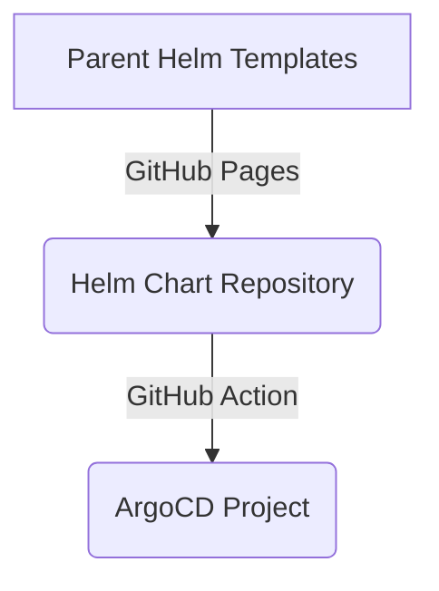

# GitHub Pages serving Helm Charts for ArgoCD

The below mermaid diagram is best viewed in Chrome browser:



#### Parent Helm Templates

##### 1. Edit the Helm templates

As per [Chart Template Guide](https://helm.sh/docs/chart_template_guide/getting_started/), edit the files

```
../vets-api-pghero/charts
├── Chart.yaml
├── templates
│   ├── basic-auth-middleware.yaml
│   ├── cronjob.yml
│   ├── deployment.yml
│   ├── external-dns.yml
│   ├── ingress.yml
│   ├── pghero.yml
│   ├── pgherobasicauthsecrets.yml
│   ├── pgherosecrets.yml
│   └── service.yml
└── values.yaml
```

#### 2. Package the Helm templates

The version specified in charts/Chart.yaml

```
grep version ../vets-api-pghero/charts/Chart.yaml 
```
> version: 0.1.2

becomes a part of the package file name, as per [Creating Your Own Charts](https://helm.sh/docs/intro/using_helm/#creating-your-own-charts)

```
helm package ../vets-api-pghero/charts --destination ../vets-api-pghero/docs  
```
> Successfully packaged chart and saved it to: ../vets-api-pghero/docs/pghero-helm102-0.1.2.tgz 

The `helm repo index` command rebuilds the `index.yaml` file:

```
helm repo index ../vets-api-pghero/docs
```

For testing, the output of the following `grep` command

```        
grep pghero-helm102 ../vets-api-pghero/docs/index.yaml                       
```
must be reflecting the list of Helm package .tgz files

```
../vets-api-pghero/docs
├── index.yaml
├── pghero-helm102-0.1.1.tgz
├── pghero-helm102-0.1.2.tgz
└── robots.txt
```

The robots.txt above helps to avoid bot crawling on my repository:

```
echo -e 'User-Agent: *\nDisallow: /' > ../vets-api-pghero/docs/robots.txt        
```

[Create a public Helm chart repository with GitHub Pages](https://medium.com/@mattiaperi/create-a-public-helm-chart-repository-with-github-pages-49b180dbb417)

#### Push the git repository on GitHub

```
git status
git add .
git commit -am 0.1.2
git push 
```

#### GitHub Pages

The following CLI call to GitHub Pages service
```
w3m -dump https://department-of-veterans-affairs.github.io/vets-api-pghero/index.yaml 
``` 

must output this page from the `parent-helm-charts' branch:

[https://github.com/department-of-veterans-affairs/vets-api-pghero/blob/parent-helm-charts/docs/index.yaml](https://github.com/department-of-veterans-affairs/vets-api-pghero/blob/parent-helm-charts/docs/index.yaml)

#### Helm Chart Repository

```
helm repo remove vets-api-pghero 
helm repo add vets-api-pghero https://department-of-veterans-affairs.github.io/vets-api-pghero/
helm search repo pghero -o json --versions | jq
```
> [  
>   {  
>     "name": "vets-api-pghero/pghero-helm102",  
>     "version": "0.1.2",  
>     "app_version": "1.0.0",  
>     "description": "A Helm chart for Kubernetes"  
>   },  
>   {  
>     "name": "vets-api-pghero/pghero-helm102",  
>     "version": "0.1.1",  
>     "app_version": "1.0.0",  
>     "description": "A Helm chart for Kubernetes"  
>   }  
> ]  


### ArgoCD

[Helm Dependency](https://helm.sh/docs/helm/helm_dependency/)

```
helm dependency update
helm template . --debug
tree ../../pghero-helm102/dev

../../pghero-helm102/dev
├── Chart.lock
├── Chart.yaml
├── charts
│   └── pghero-helm102-0.1.2.tgz
├── templates
│   └── secrets.yaml
└── values.yaml

rm -rf Chart.lock charts/
git status
git add .
git commit -am 0.1.2
git push
```

#### Troubleshooting

Try running all charts through helm template and then taking the output through `kubectl apply --dry-run`, which acts as a linter. 

Listing dependencies 

```
helm dependency list
```

One possibility is a manual `helm install` run:

```
helm list -A
helm repo add vets-api-pghero https://department-of-veterans-affairs.github.io/vets-api-pghero/
helm repo update
helm install pghero-helm102-dev vets-api-pghero/pghero-helm102 --namespace pghero-helm102 --replace \
--debug 
```
or

```
helm upgrade --install pghero-helm102-dev vets-api-pghero/pghero-helm102 --namespace pghero-helm102 \
--debug 
```

In a few minutes the endpoint must be responding:

```
curl --proxy socks5h://127.0.0.1:2001 -sI http://pghero-helm102-dev.vfs.va.gov 
```

### Links

- [confluence: Parent Helm Chart Setup](https://vfs.atlassian.net/wiki/spaces/TT1/pages/2400256031/Parent+Helm+Chart+Setup)
- [levelup1: Helm Chart Dependencies](https://levelup.gitconnected.com/helm-dependencies-1907facbe410)
- [levelup2: Data exchange between parent and child chart in helm](https://levelup.gitconnected.com/helm-data-sharing-between-parent-and-child-chart-c4487a452d4e)
- [levelup3: Helm Templates Variables overview](https://medium.com/codex/helm-variables-df1dca52ed46)
- [visualstudio: Working with Kubernetes in VS Code](https://code.visualstudio.com/docs/azure/kubernetes)


