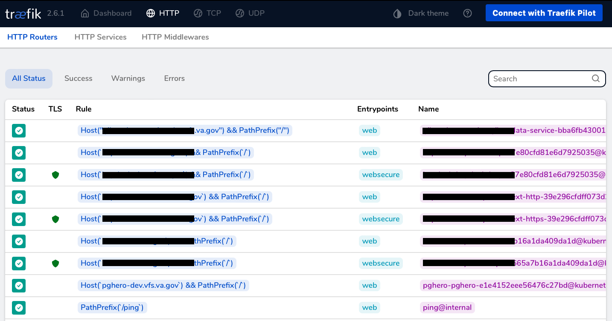
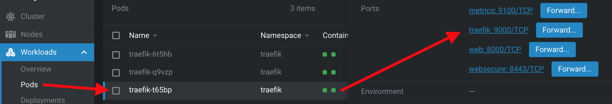
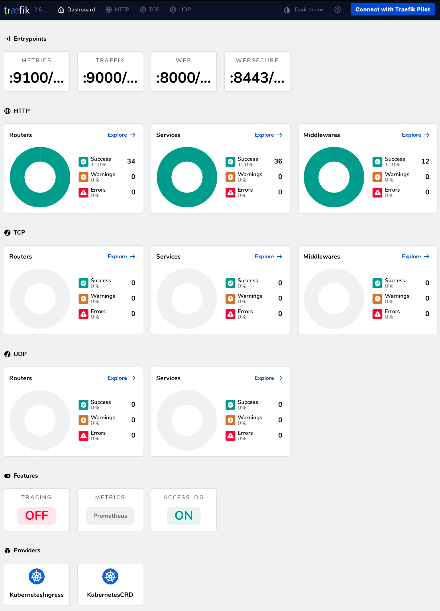

# GitHub Pages serving Parent Helm Charts for ArgoCD


### 1. Composing Parent Helm Chart

Kubernetes provide logical isolation of resources by `namespace` and physical isolation by `cluster`:


##### 1.0.1. Edit the Helm templates

As per [Chart Template Guide](https://helm.sh/docs/chart_template_guide/getting_started/), edit the files, keeping in mind that it is ok for resources to have the same names for as long as they are meant for different clusters, such as dev, staging, prod, etc.

```
../vets-api-pghero/charts
├── Chart.yaml
├── templates
│   ├── basic-auth-middleware.yaml
│   ├── cronjob.yml
│   ├── deployment.yml
│   ├── external-dns.yml
│   ├── ingress.yml
│   ├── pghero.yml
│   ├── pgherobasicauthsecrets.yml
│   ├── pgherosecrets.yml
│   └── service.yml
└── values.yaml
```

#### 1.0.2. Package the Helm charts

The version specified in charts/Chart.yaml

```
grep version ../vets-api-pghero/charts/Chart.yaml 
```
> version: 0.1.2

becomes a part of the package file name, as per [Creating Your Own Charts](https://helm.sh/docs/intro/using_helm/#creating-your-own-charts)

```
helm package ../vets-api-pghero/charts --destination ../vets-api-pghero/docs  
```
> Successfully packaged chart and saved it to: ../vets-api-pghero/docs/pghero-helm102-0.1.2.tgz 

The `helm repo index` command rebuilds the `index.yaml` file:

```
helm repo index ../vets-api-pghero/docs
```

For testing, the output of the following `grep` command

```        
grep pghero-helm102 ../vets-api-pghero/docs/index.yaml                       
```
must be reflecting the list of Helm package .tgz files

```
../vets-api-pghero/docs
├── index.yaml
├── pghero-helm102-0.1.1.tgz
├── pghero-helm102-0.1.2.tgz
└── robots.txt
```

#### 1.0.3. robots.txt for crawlers

The robots.txt file helps to avoid bot crawling on the charts repository:

```
echo -e 'User-Agent: *\nDisallow: /' > ../vets-api-pghero/docs/robots.txt        
```

Google has a TLDR explanation on [what a robots.txt file is used for](https://developers.google.com/search/docs/crawling-indexing/robots/intro#what-is-a-robots.txt-file-used-for)

### 2. Publishing Parent Helm Charts on GitHub Pages


[medium:Create a public Helm chart repository with GitHub Pages](https://medium.com/@mattiaperi/create-a-public-helm-chart-repository-with-github-pages-49b180dbb417)


#### 2.0.1. Push the git repository on GitHub

```
git status
git add .
git commit -am 0.1.2
git push 
```

Upon `git push` to `parent-helm-charts` branch, GitHub automation would publish the updated content via GitHub Pages:


### 2.0.2. GitHub Pages web service

In about 2 minutes after the git push event, the following CLI call to GitHub Pages web service
```
w3m -dump https://department-of-veterans-affairs.github.io/vets-api-pghero/index.yaml 
``` 

must output this page from the `parent-helm-charts` branch:

[https://github.com/department-of-veterans-affairs/vets-api-pghero/blob/parent-helm-charts/docs/index.yaml](https://github.com/department-of-veterans-affairs/vets-api-pghero/blob/parent-helm-charts/docs/index.yaml)

### 3. Rendering Helm Subchart with dependencies from Parent Chart

ArgoCD acts as the Rendering Engine on the below sequence diagram: 


```
vsp-infra-application-manifests/apps/pghero-helm102/
└── dev
    ├── Chart.yaml
    ├── templates
    │   └── secrets.yaml
    └── values.yaml
```


**tail -4 vsp-infra-application-manifests/apps/pghero-helm102/dev/Chart.yaml**

```
dependencies:
  - name: pghero-helm102
    version: "0.1.2"
    repository: "https://department-of-veterans-affairs.github.io/vets-api-pghero/"
```

### 4. Subchart (dependency) testing

As per [Helm Dependency doc](https://helm.sh/docs/helm/helm_dependency/)

```
helm dependency update
helm dependency list
helm template . --debug
tree ../../pghero-helm102/dev

../../pghero-helm102/dev
├── Chart.lock
├── Chart.yaml
├── charts
│   └── pghero-helm102-0.1.2.tgz
├── templates
│   └── secrets.yaml
└── values.yaml

rm -rf Chart.lock charts/
git status
git add .
git commit -am 0.1.2
git push
```

### 5. Troubleshooting

For troubleshooting purposes, the helm CLI utility can be used as the charts rendering engine instead of ArgoCD.

```
helm repo remove vets-api-pghero 
helm repo add vets-api-pghero https://department-of-veterans-affairs.github.io/vets-api-pghero/
helm search repo pghero -o json --versions | jq
```
> [  
>   {  
>     "name": "vets-api-pghero/pghero-helm102",  
>     "version": "0.1.2",  
>     "app_version": "1.0.0",  
>     "description": "A Helm chart for Kubernetes"  
>   },  
>   {  
>     "name": "vets-api-pghero/pghero-helm102",  
>     "version": "0.1.1",  
>     "app_version": "1.0.0",  
>     "description": "A Helm chart for Kubernetes"  
>   }  
> ]  


Try running all charts through helm template and then taking the output through `kubectl apply --dry-run`, which acts as a linter. 

Listing dependencies 

```
helm dependency list
```

One possibility is a manual `helm install` run:

```
helm list -A
helm repo remove vets-api-pghero 
helm repo add vets-api-pghero https://department-of-veterans-affairs.github.io/vets-api-pghero/
helm repo update
helm upgrade --install pghero-helm102-dev vets-api-pghero/pghero-helm102 --namespace pghero-helm102 \
--debug
```

In a few minutes the endpoint must be responding:

```
curl --proxy socks5h://127.0.0.1:2001 -sI http://pghero-helm102-dev.vfs.va.gov 
```

### 6. Traefik dashboard with Lens.app

Traefik comes with a handy dashboard that provides a detailed overview of the current status of your cluster.
This includes all the current routes being handled by the cluster with the status.



The dashboard behaves as a service called api@internal, so it is possible to leverage all of
Traefik's routing capabilities to build the most suited configuration.
For a more in-depth explanation please refer to the [Traefik documentation](https://docs.traefik.io/v2.6/operations/dashboard/#secure-mode).

_**Prereq: [install Kubernetes Lens Desktop](https://docs.k8slens.dev/getting-started/install-lens/)**_

Lens.app > cluster arn:aws-us-gov:eks:us-xxxxxx-1:0123456789:cluster/dsva-vagov-dev-cluster > Workloads > Pods > Any Pod > Ports > traefik:9000 Forward > 8080




When a new browser window opens, don't be discouraged by the 404 response from localhost:8080

Type localhost:8080/dashboard/ in the browser address bar and observe the Traefik dashboard working:




### 7. Links

- [googledocs: PgHero Modernization](https://docs.google.com/presentation/d/15JhkVHX8NODiSbjPxbJZJhRdfj93cO-RDpOAg2HPeHY/edit?usp=sharing)
- [confluence: VA.Gov Platform Manual WIP](https://vfs.atlassian.net/wiki/spaces/OT/pages/2354315287/VA.Gov+Platform+Manual+WIP)
- [confluence: Build a Helm chart for EKS](https://vfs.atlassian.net/wiki/spaces/OT/pages/2350645620/Build+a+Helm+chart+for+EKS)
- [confluence: Parent Helm Chart Setup](https://vfs.atlassian.net/wiki/spaces/TT1/pages/2400256031/Parent+Helm+Chart+Setup)
- [levelup1: Helm Chart Dependencies](https://levelup.gitconnected.com/helm-dependencies-1907facbe410)
- [levelup2: Data exchange between parent and child chart in helm](https://levelup.gitconnected.com/helm-data-sharing-between-parent-and-child-chart-c4487a452d4e)
- [levelup3: Helm Templates Variables overview](https://medium.com/codex/helm-variables-df1dca52ed46)
- [visualstudio: Working with Kubernetes in VS Code](https://code.visualstudio.com/docs/azure/kubernetes)


